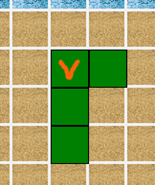
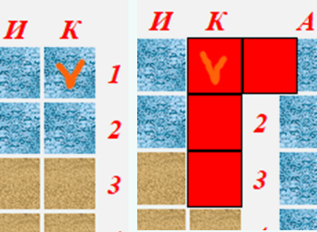
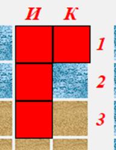
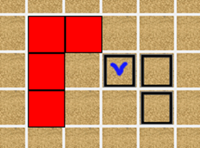
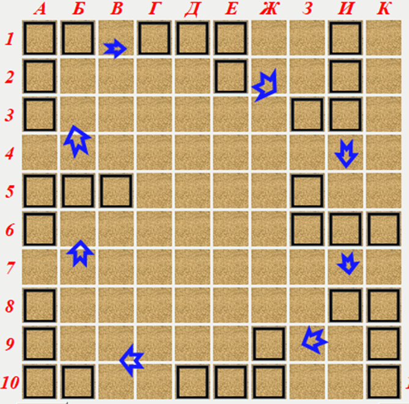
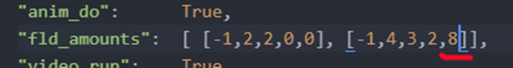
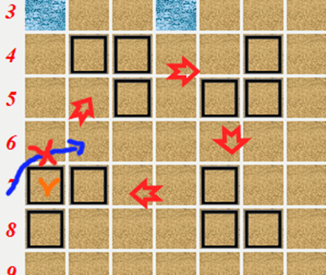

## Программирование
​Автор: Мазлов Иван
​ <h3> Второй семестр </h3>

МИНИСТЕРСТВО НАУКИ  И ВЫСШЕГО ОБРАЗОВАНИЯ РОССИЙСКОЙ ФЕДЕРАЦИИ 
Федеральное государственное автономное образовательное учреждение высшего образования 
"КРЫМСКИЙ ФЕДЕРАЛЬНЫЙ УНИВЕРСИТЕТ им. В. И. ВЕРНАДСКОГО" 
ФИЗИКО-ТЕХНИЧЕСКИЙ ИНСТИТУТ 
Кафедра компьютерной инженерии и моделирования

 
<h3 align="center">Пояснения к интерфейсу курсового проекта "Морской Бой"  по дисциплине "Программирование"</h3>
  

студента 1 курса группы ИВТ-б-о-201(2) 
Мазлова Ивана Денисовича 
направления подготовки 09.03.01 "Информатика и вычислительная техника"

  
<table>
<tr><td>Научный руководитель  Старший преподаватель Кафедры  компьютерной инженерии и моделирования</td>
<td>(&nbsp;&nbsp;&nbsp;&nbsp;&nbsp;&nbsp;&nbsp;&nbsp;&nbsp;&nbsp;&nbsp;&nbsp;&nbsp;&nbsp;&nbsp;&nbsp;&nbsp;&nbsp;&nbsp;&nbsp;&nbsp;&nbsp;&nbsp;&nbsp;&nbsp;&nbsp;&nbsp;&nbsp;&nbsp;&nbsp;&nbsp;&nbsp;)</td>
<td>Чабанов В.В.</td>
</tr>
</table>
  

 Симферополь, 2021

<h1>Пояснения к интерфейсу курсового проекта<h1>

 
<h1>"Морской Бой"<h1>

<h2>Интерфейс и как с ним работать</h2>
Я старался сделать интерфейс максимально простым и интуитивно понятным, однако некоторые моменты всё же нужно описать подробнее.
Установка кораблей на поле: 
- начать укстановку\убрать зеленый корабль - правая кнопка мыши 
- установить окончательно - превратить в квадратики - средняя кнопка мыши (button-2) 
- перетаскивать как обычно - зажата левая кнопка мыши 
- стрелять - клик по полю противника левой кнопкой мыши (когда статус: Ваш ход) 

Теперь подробнее про установку кораблей:

Рис 1. Стартовый тип 4-х палубного объекта.

4-х палубный начинается всегда с такого типа. Галочкой помечена «базовая клетка» корабля, определяющая его координаты как объекта. Это та самая клетка, по которой Вы кликнули правой кнопкой мышки. Именно от этой позиции и отстраивается весь корабль.

Рис 2. Головная клетка корабля определяет x,y объекта на карте.

   
Соответственно в клетке «К1» и не удастся такой корабль поставить. Нельзя его туда и притащить, т.к. контролируются границы поля.

Рис 3. Контроль границ установки корабля.

 
После попытки перетаскивания корабля на «К1» отбросит в ближайшую точку, где все клетки влезут в поле – на «И1».
В момент клика по полю определяется ТИП корабля. Если кликнули на землю – земной, если на воду – водный. Таким образом, все клетки корабля уже обязаны находиться на таком же типе территории, что и головная клетка (т.е. та, по которой кликнули в самом начале). Если это не соблюдается или 

Рис 4. Контроль дистанции до других объектов.

 
уже что-то стоит в радиусе одной клетки (по стандартным правилам игры) от любой клетки устанавливаемого корабля, то тоже будет помечен красным и поставить не получится.

Рис 5. Порядок ротации 4-х палубных объектов наземного типа.

 
Вот последовательность смены четырехпалубных кораблей. Она – замкнутая.
На скриншоте, естественно, «хакнутая» ситуация, чтобы проще скриншот было сделать поменяно базовое количество типов кораблей:

Рис 6. Хакинг кода для удобства скриншота.
 

Обычно тут стоит единица.
Та же картина с трехпалубными:

Рис 7. Порядок ротации 3-х палубных объектов наземного типа.
  

Естественно, что т.к. в последнем корабле «базовая клетка» (отмечена оранжевым) слишком прижата влево к краю поля, следующий поворот по часовой стрелке сделать не удастся, т.к. оборот идет вокруг угловой клетки. Команда будет просто проигнорирована. Нужно или оттащить корабль вправо или поворачивать в другую сторону.
Колесико мышки крутит корабли и по часовой и против часовой стрелки.

Пока корабль зелененький, он никуда не добавлен и его можно крутить и перетаскивать. Если поставили, он становится квадратиками на поле. Можно либо кликнуть правой кнопкой мышки и ставить следующий корабль (по убыванию палубности), либо правой кнопкой ввести в режим «зелененького» уже поставленный корабль.
В любом случае система сначала предлагает поставить корабль с самым большим количеством палуб.
Ещё хочу сказать, что перетаскивать корабль желательно за «базовую клетку». Т.е. за остальные он тоже перетаскивается, но при многопалубности немного не точно ставится.
Базовая клетка корабля – или угловая или самая верхняя или самая левая, в зависимости от типа корабля.

Я планировал сделать и чат, и подобие 3-d анимации, и более качественную стилизацию и AI, но на всё это не хватило времени. Однако в коде осталось немало процедур, подготовленных для реализации этих задач (зачастую они просто есть и никак не используются). Может смогу доделать позже и реализовать все задумки.

Ещё хотел сказать по поводу анимации видеозаставок. На моем компьютере всё подогнанои синхронизированы изображение и звук, но на ноутбуке всё поползло, т.к. зависит от мощности процессора. Как сделать одинаково работающий по скорости вариант я ещё изучаю.
В видео на moodle выложен ролик именно с моего компьютера, где всё синхронизировано.
На стартовом экране чуть чуть подождите (секунд 30) изменение звука после радио - такая задумка.

Хотелось сделать ярко и с юмором, а вышло только так из-за жуткой нехватки времени.

Спасибо за внимание к этому проекту.
