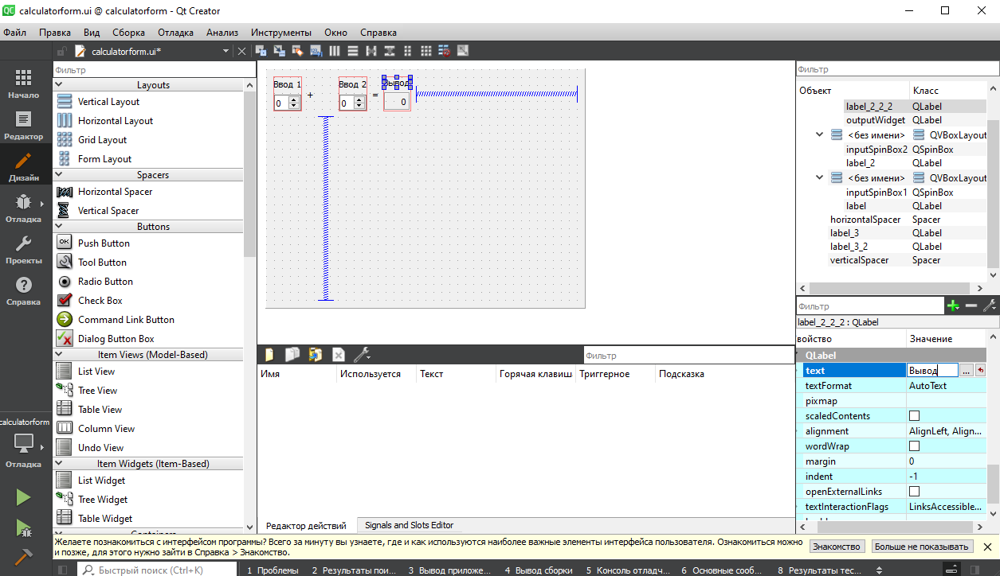
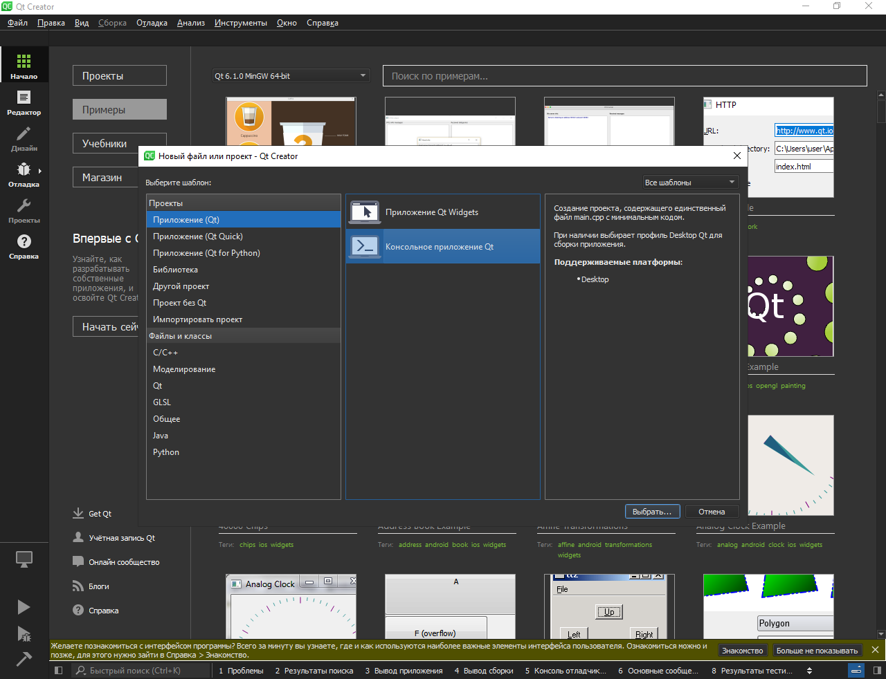
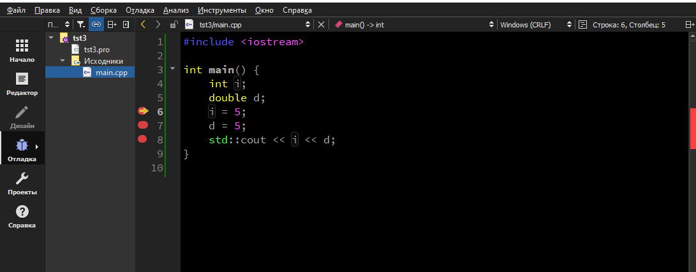
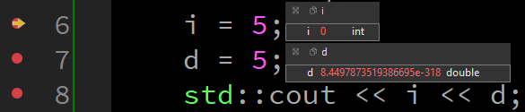
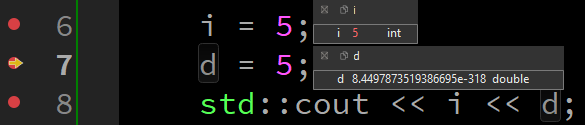
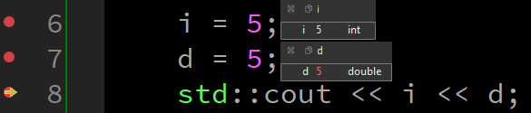

## Программирование
​Автор: Мазлов Иван
​<br><h3> Второй семестр </h3>
<p align="center">МИНИСТЕРСТВО НАУКИ  И ВЫСШЕГО ОБРАЗОВАНИЯ РОССИЙСКОЙ ФЕДЕРАЦИИ<br>
Федеральное государственное автономное образовательное учреждение высшего образования<br>
"КРЫМСКИЙ ФЕДЕРАЛЬНЫЙ УНИВЕРСИТЕТ им. В. И. ВЕРНАДСКОГО"<br>
ФИЗИКО-ТЕХНИЧЕСКИЙ ИНСТИТУТ<br>
Кафедра компьютерной инженерии и моделирования</p>
<br>
<h3 align="center">Отчёт о лабораторной работе № 4<br> по дисциплине "Программирование"</h3>
<br><br>
<p>студента 1 курса группы ИВТ-б-о-201(2)<br>
Мазлова Ивана Денисовича<br>
направления подготовки 09.03.01 "Информатика и вычислительная техника"</p>
<br><br>
<table>
<tr><td>Научный руководитель<br> Старший преподаватель Кафедры<br> компьютерной инженерии и моделирования</td>
<td>(&nbsp;&nbsp;&nbsp;&nbsp;&nbsp;&nbsp;&nbsp;&nbsp;&nbsp;&nbsp;&nbsp;&nbsp;&nbsp;&nbsp;&nbsp;&nbsp;&nbsp;&nbsp;&nbsp;&nbsp;&nbsp;&nbsp;&nbsp;&nbsp;&nbsp;&nbsp;&nbsp;&nbsp;&nbsp;&nbsp;&nbsp;&nbsp;)</td>
<td>Чабанов В.В.</td>
</tr>
</table>
<br><br>
<p align="center" > Симферополь, 2021</p>
<hr>


<p align="center"><h1>Лабораторная работа №4<br>Знакомство с фреймворком Qt<h1></p>

<h2>Постановка задачи</h2>
<p>&nbsp;&nbsp;&nbsp;&nbsp;Настроить рабочее окружение для разработки программного обеспечения при помощи Qt и IDE Qt Creator, а также изучить базовые возможности данного фреймворка.</p>

<h2>Выполнение работы</h2>

<h3>Задание 1</h3>

&nbsp;&nbsp;&nbsp;&nbsp;Сначала я зарегистрировал аккаунт на сайте QT и загрузил онлайн-инсталлятор. Установил Qt Creator Community (для Windows-10 64-bit) на компьютер.
Во время установки я также установил Mingv v6.1.0.
Далее я приступил к выполнению заданий лабораторной работы.<br>
&nbsp;&nbsp;&nbsp;&nbsp;Открыл проект <b>Calculator Form Example</b> и изменил названия полей:
<p align="center"></p>
<p align="center">Рис 1. Дизайнер Qt Creator.</p>
<br>
<h3>Задание 2</h3>
<br>
<table>
<tr> <td><b><p align="center">Вопрос</p></b></td><td><b><p align="center">Ответ</p></b></td> </tr>
<tr><td>Как изменить цветовую схему (оформление) среды?</td>
	<td>Инструменты-Параметры-Интерфейс-Среда-Тема<br>
	Для смены цвета шрифта: Параметры-Текстовый редактор-выбрать шрифт и цвет.
	</td></tr>
<tr><td>Как закомментировать/раскомментировать блок кода средствами Qt Creator? Имеется ввиду комбинация клавиш или пункт меню.</td>
	<td>Правка-Дополнительно-Закомментировать или Ctrl+/</td></tr>
<tr><td>Как открыть в проводнике Windows папку с проектом средствами Qt Creator?</td>
	<td>в режиме редактирования клик правой кнопкой мышки на папке - Показать в проводнике</td></tr>
<tr><td>Какое расширение файла-проекта использует Qt Creator? Может быть несколько ответов.</td>
	<td>pro</td></tr>
<tr><td>Как запустить код без отладки?</td>
	<td>Ctrl+r</td></tr>
<tr><td>Как запустить код в режиме отладки?</td>
	<td>F5</td></tr>
<tr><td>Как установить/убрать точку останова (breakpoint)?</td>
	<td>левой кнопкой мышки кликнуть немного левее номера строки (напротив строки появляется красный кружок)</td></tr>
</table>

<br>
<h3>Задание 3</h3>
Я создал консольное приложение Qt.
<p align="center"></p>
<p align="center">Рис 2. Создание консольного приложения.</p>

Далее я скопировал в него код из задания:

```c++
#include <iostream>

int main() {
    int i;
    double d;
    i = 5;
    d = 5;
    std::cout << i << d;
}

```
Выполнил задание 3.
<p align="center"></p>
<p align="center">Рис 3. Отладка в Qt Creator.</p>

<br>
<table>
<tr>
<tr> <td><b><p align="center">Вопрос</p></b></td><td><b><p align="center">Ответ</p></b></td></tr>
<tr> <td>Чему равны переменные i и d в 6-й строке (тут и далее нужно написать значения);</td>
	<td>
	i=0 (мусорное значение); d=8.44978.. (мусорное значение)<br><br>
	<p align="center"></p>
	<p align="center">Рис 4. Значение переменных в строке 6.</p>
	</td></tr>
<tr> <td>Чему равны переменные i и d в 7-й строке;</td>
	<td>
	i=5; d=8.44978.. (мусорное значение)<br><br>
	<p align="center"></p>
	<p align="center">Рис 5. Значение переменных в строке 7.</p>
	</td></tr>
<tr> <td>Чему равны переменные i и d в 8-й строке;</td>
	<td>
	i=5; d=5<br><br>
	<p align="center"></p>
	<p align="center">Рис 6. Значение переменных в строке 8.</p>
	</td></tr>
</tr>
</table>


<h2>Вывод</h2>
&nbsp;&nbsp;&nbsp;&nbsp; В ходе работы я впервые познакомился с кроссплатформенной средой разработки Qt Creator: 
установил и настроил среду, загрузил пример Calculator Form Example (из демонстрационных примеров, доступных в комплекте установки), 
изменил названия полей в нем.
Я также научился создавать консольные приложения, освоил первичные навыки работы с редактором, процесс отладки приложения.
<br>&nbsp;&nbsp;&nbsp;&nbsp;В дальнейшем попробую использовать Qt Creator для разработки новых проектов.


