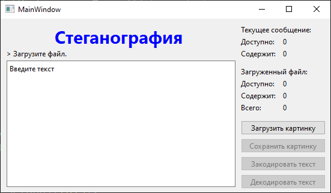
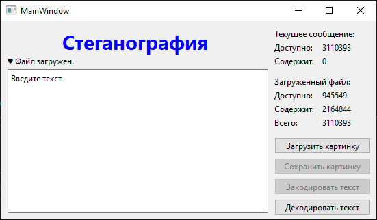
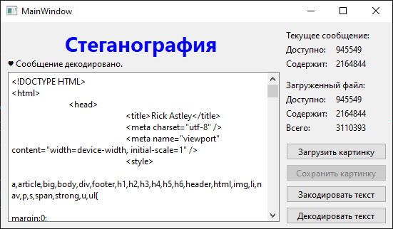
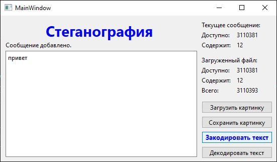
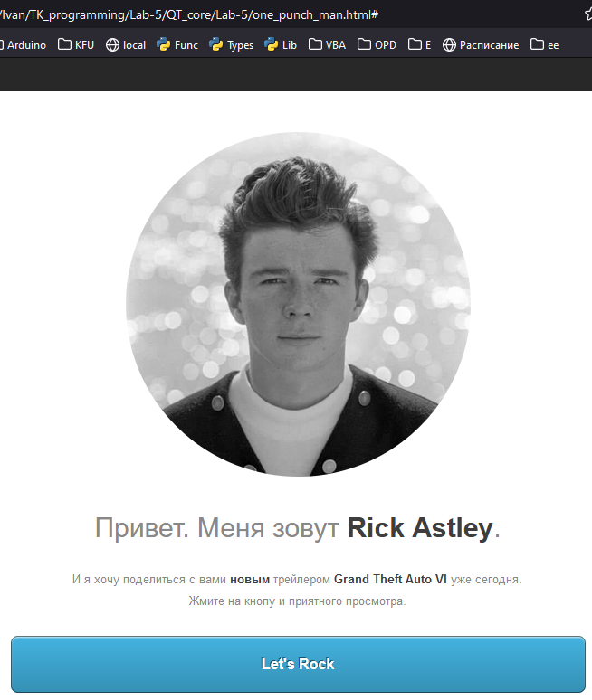

## Программирование
​Автор: Мазлов Иван
​<br><h3> Второй семестр </h3>
<p align="center">МИНИСТЕРСТВО НАУКИ  И ВЫСШЕГО ОБРАЗОВАНИЯ РОССИЙСКОЙ ФЕДЕРАЦИИ<br>
Федеральное государственное автономное образовательное учреждение высшего образования<br>
"КРЫМСКИЙ ФЕДЕРАЛЬНЫЙ УНИВЕРСИТЕТ им. В. И. ВЕРНАДСКОГО"<br>
ФИЗИКО-ТЕХНИЧЕСКИЙ ИНСТИТУТ<br>
Кафедра компьютерной инженерии и моделирования</p>
<br>
<h3 align="center">Отчёт о лабораторной работе № 5<br> по дисциплине "Программирование"</h3>
<br><br>
<p>студента 1 курса группы ИВТ-б-о-201(2)<br>
Мазлова Ивана Денисовича<br>
направления подготовки 09.03.01 "Информатика и вычислительная техника"</p>
<br><br>
<table>
<tr><td>Научный руководитель<br> Старший преподаватель Кафедры<br> компьютерной инженерии и моделирования</td>
<td>(&nbsp;&nbsp;&nbsp;&nbsp;&nbsp;&nbsp;&nbsp;&nbsp;&nbsp;&nbsp;&nbsp;&nbsp;&nbsp;&nbsp;&nbsp;&nbsp;&nbsp;&nbsp;&nbsp;&nbsp;&nbsp;&nbsp;&nbsp;&nbsp;&nbsp;&nbsp;&nbsp;&nbsp;&nbsp;&nbsp;&nbsp;&nbsp;)</td>
<td>Чабанов В.В.</td>
</tr>
</table>
<br><br>
<p align="center" > Симферополь, 2021</p>
<hr>

<p align="center"><h1>Лабораторная работа №5<br>Стеганография<h1></p>

<h2>Постановка задачи</h2>
<p>&nbsp;&nbsp;&nbsp;&nbsp;Создать десктоп-приложение с GUI, позволяющее сохранять текстовую информацию в изображение формата png без видимого изменения исходного изображения. Приложение должно позволять сохранять текст в картинку и извлекать текст из картинки.</p>

<h2>Выполнение работы</h2>

<h3>Изучение теоретической части</h3>
&nbsp;&nbsp;&nbsp;&nbsp;В ходе работы я изучил строение файлов формата png и понял, что каждый пиксель изображения в формате RGB кодируется тремя байтами интенсивности цвета: красный, зеленый и синий. Так как 256 значений для каждого цвета - достаточно большой разброс, то изменение младшего бита байта, кодирующего цвет, может привести к изменению интенсивности всего на единицу, что будет незаметно при обычном просмотре. Такая ситуация позволяет использовать этот младший бит для кодирования внутри изображения своей информации.
Каждый пиксель png-файла кодируется тремя байтами, а значит, с каждого пикселя можно получить три бита "свободного" для кодирования пространства.
Таким образом были написаны программы на c++ и на Python, которые могут:
<ul>
   <li>загружать графические файлы png;</li>
   <li>получать в текстовом виде в поле ввода информацию от пользователя;</li>
   <li>переводить её в формат 'utf-8', разбивать побитно;</li>
   <li>записывать эту побитную информацию, использую младший бит каждого из трех байт в каждом пикселе;</li>
   <li>сохранять измененный файл;</li>
   <li>проводить обратное действие: считывать файл, определять наличие сообщения в нем, считывать его и выводить в форме вывода.</li>
  </ul>

&nbsp;&nbsp;&nbsp;&nbsp;Получился вот такой интерфейс программы.
<p align="center"></p>
<p align="center">Рис 1. Вид окна кодировщика сразу после запуска.</p>
<br>

&nbsp;&nbsp;&nbsp;&nbsp;Большая часть кнопок при запуске - неактивна. Так как понятно, что если ещё не загрузили файл, то нечего и декодировать.<br>

&nbsp;&nbsp;&nbsp;&nbsp;Если в загруженном png есть закодированное сообщение, то перед надписью "Файл загружен" появляется значок сердечка, активируется кнопка "Декодировать текст" и отображается статистика в двух блоках: Текущее сообщение и Загруженный файл.

<p align="center"></p>
<p align="center">Рис 2. Вид окна после загрузки png-картинки с сообщением.</p>
<br>

&nbsp;&nbsp;&nbsp;&nbsp;Блок "Текущее сообщение" отображает информацию о тексте, находящемся в поле ввода: сколько символов уже введено в поле и сколько ещё осталось ввести (т.е. сколько позволяет "спрятать" загруженный файл минус 7 байт).
При рассчете доступного количества "свободного" места необходимо помнить, что символы в кириллице в кодировке 'utf-8' занимают не один, а два байта.

<p align="center"></p>
<p align="center">Рис 3. Вид окна после декодирования сообщения.</p>
<br>

&nbsp;&nbsp;&nbsp;&nbsp;Так как мы только что декодировали сообщение, оно было отображено в поле ввода и, соответственно, поменялось значение "Содержит" в блоке "Текущее сообщение" и активировалась кнопка "Закодировать текст" (т.к. поле ввода уже не пустое).


<p align="center"></p>
<p align="center">Рис 4. Вид окна после декодирования сообщения.</p>
<br>
&nbsp;&nbsp;&nbsp;&nbsp;Мы можем ввести какое-то новое сообщение и "Закодировать текст". После этого файл png уже является изменившимся и активируется кнопка "Сохранить картинку".


<h3>Программа на c++</h3>
&nbsp;&nbsp;&nbsp;&nbsp;При написании программы на c++ я следовал указаниям из методички лабораторной работы. 
Разработал дизайн интерфейса пользовательской формы. Научился подключать форму, создавать слоты и подключать к ним сигналы в QT Creator. Освоился с самим интерфейсом QT Creator - он мне понравился даже больше, чем Visual Studio.

&nbsp;&nbsp;&nbsp;&nbsp;Код программы на c++:

mainwindow.h:
```c
#ifndef MAINWINDOW_H
#define MAINWINDOW_H

#include <QMainWindow>
#include <QImage>

QT_BEGIN_NAMESPACE
namespace Ui { class MainWindow; }
QT_END_NAMESPACE

class MainWindow : public QMainWindow
{
    Q_OBJECT

    // file vars
    uint32_t M          = 0xffffffff; // маркер длины, обозначает, что файл не загружен
    uint32_t msg_max    = M; //0x0;        // общая ёмкость файла - 7 байт
    uint32_t msg_in     = 0x0;        // количество байт сообщения внутри файла

    uint32_t input_size = 0x0;        // размер поля input в байтах
    uint32_t input_free = 0x0;        // осталось свободных байт

    uint32_t const mark = 0xe29da4; // 24-bit идентификатор наличия сообщения в файле //0b111000101001110110100100;

    uint8_t cur_bit = 3; // текущий бит в RGB
    int rb_x = -1, rb_y = 0;

    QImage img;
    QColor rb_pixel;

    void writebyte(uint8_t);
    uint8_t readbyte();  // поточное чтение байт


public slots:
    void loadImage();
    void saveImage();
    void encode();
    void decode();
    void msgChanged();

public:
    MainWindow(QWidget *parent = nullptr);
    ~MainWindow();

private:
    Ui::MainWindow *ui;
};
#endif // MAINWINDOW_H
```

<br><br>

mainwindow.cpp:

```c
#include "mainwindow.h"
#include "ui_mainwindow.h"
#include <QFileDialog>
#include <QByteArray>
#include <QString>

void MainWindow::writebyte(uint8_t b){
    uint8_t bits=8, mask;
    while (bits--){
        mask = (b & 0x80) >> 7;
        switch (cur_bit){
            case 3:
                cur_bit = 0;
                img.setPixelColor(rb_x, rb_y, rb_pixel);
                if (++rb_x>=img.width()){rb_x=0;rb_y++;}
                rb_pixel = img.pixelColor(rb_x, rb_y);
            case 0:
                rb_pixel.setRed(  (rb_pixel.red()  &0xfe) | mask );
                break;
            case 1:
                rb_pixel.setGreen((rb_pixel.green()&0xfe) | mask );
                break;
            default: // 2
                rb_pixel.setBlue( (rb_pixel.blue() &0xfe) | mask );
        }
    b=b<<1; cur_bit++;
    }
}

uint8_t MainWindow::readbyte(){
    uint8_t ret=0, bits=8, mask;
    while (bits--){
        ret=ret<<1;
        switch (cur_bit){
            case 3:
                cur_bit = 0;
                if (++rb_x>=img.width()){rb_x=0;rb_y++;}
                rb_pixel = img.pixelColor(rb_x, rb_y);
            case 0:
                mask = rb_pixel.red()&1;
                break;
            case 1:
                mask = rb_pixel.green()&1;
                break;
            default: // 2
                mask = rb_pixel.blue()&1;
        }
        ret|=mask; cur_bit++;
    }
    return ret;
}

void MainWindow::loadImage(){
    QString fileName = QFileDialog::getOpenFileName(this, tr("Open Image"), "", tr("Допустимые форматы (*.png)"));
    if (fileName == ""){
        if (msg_max==M) ui->info->setText("Загрузка отменена. Загрузите файл.");
        else            ui->info->setText("Загрузка отменена. Прежний файл.");
        return;}

    cur_bit = 3; rb_x = -1, rb_y = 0; uint32_t res = 0;
    img.load(fileName);
    img.convertTo(QImage::Format_ARGB32);

    msg_max = img.width() * img.height() * 3 / 8;

    if (msg_max<=7){ // файл очень маленький
        ui->info->setText("Файл загружен, но он слишком маленький.");
        msg_in = 0; msg_max=0; input_free=0;
        ui->btn_decode->setEnabled(false);
        ui->btn_encode->setEnabled(false);
        ui->btn_save->setEnabled(false);

        ui->inp_free->setText(QString::number(0));
        ui->inp_size->setText(QString::number(0));
        return;}

    msg_max-=7;
    // проверка наличия подписи в маркера в файле
    for (int i=0;i<3;i++) res=(res<<8)|MainWindow::readbyte();
    msg_in=0;
    if (res==mark) {
        for (int i=0;i<4;i++) msg_in=(msg_in<<8)|MainWindow::readbyte();
    }

    QString res_msg = ((msg_in)? "♥ ":"");
    if (msg_in>msg_max){ // ошибочная длина сообщения - больше, чем объем файла
        msg_in=msg_max;  // корректируем на максимум
        res_msg = "?"+res_msg;
    }

    res_msg+= "Файл загружен.";
    ui->info->setText(res_msg);
    ui->inp_free->setText(QString::number(msg_max));

    ui->ffree->setText(QString::number(msg_max-msg_in));
    ui->ftotal->setText(QString::number(msg_max));
    ui->fhave->setText(QString::number(msg_in));

    if (msg_in) ui->btn_decode->setEnabled(true);
    else ui->btn_decode->setEnabled(false);

    if (input_size) ui->btn_encode->setEnabled(true);
    else ui->btn_encode->setEnabled(false);
}

void MainWindow::saveImage(){
    QString fileName = QFileDialog::getSaveFileName(this, tr("Save Image"), "", tr("Допустимые форматы (*.png)"));
    if (fileName != ""){
        img.save(fileName, 0, -1);
        ui->info->setText("Изображение успешно сохранено");
        ui->btn_save->setEnabled(false);
        ui->btn_decode->setEnabled(true);
    }
    else{ ui->info->setText("Сохранение отменено.");}
}

void MainWindow::encode(){
    cur_bit = 0; rb_x = 0; rb_y = 0; rb_pixel = img.pixelColor(rb_x, rb_y);
    writebyte(0xe2); writebyte(0x9d); writebyte(0xa4); // записываем маркер в начало файла

    uint32_t m_size = input_size;
    uint8_t byte_write = 0;
    for (int i=0;i<4;i++){
        byte_write = 0;
        for (int j=0;j<8;j++){
            byte_write = byte_write << 1;
            if (m_size&0x80000000) byte_write = byte_write | 1;
            m_size=m_size<<1;
        }
        writebyte(byte_write);
    }

    QByteArray txt = ui->input->toPlainText().toUtf8();
    input_size = txt.size();

    for (uint32_t i=0; i<input_size;i++){
        writebyte(txt[i]);
    } img.setPixelColor(rb_x, rb_y, rb_pixel);

    ui->btn_decode->setEnabled(true);
    ui->btn_save->setEnabled(true);
    ui->info->setText("Сообщение добавлено.");
    ui->ffree->setText(QString::number(msg_max-input_size));
    ui->fhave->setText(QString::number(input_size));
}

void MainWindow::decode(){
    if ((msg_max==M) or (!msg_in)) return;

    // определение стартовой позиции
    rb_y = 56/(img.width()*3); // 7 байт заголовка * 8 бит = 56 бит
    rb_x = (56 - img.width()*3*rb_y)/3; // бит в строке

    cur_bit = 2; //rb_x = 18; rb_y = 0;
    rb_pixel = img.pixelColor(rb_x, rb_y);
    QByteArray msg;

    for (uint32_t i=0; i<msg_in; i++) msg.push_back(MainWindow::readbyte()) ;
    ui->input->setPlainText( QString::fromUtf8(msg) );
    input_size=msg_in;

    QString res_msg = ((msg_in)? "♥ ":"");
    res_msg+= "Сообщение декодировано.";
    ui->info->setText(res_msg);
    ui->btn_encode->setEnabled(true);
    ui->btn_save->setEnabled(false);

    input_free = msg_max - input_size;
    ui->inp_size->setText(QString::number(input_size));
    ui->inp_free->setText(QString::number(input_free));
}

void MainWindow::msgChanged(){
    QByteArray txt = ui->input->toPlainText().toUtf8();
    input_size = txt.size();
    if (msg_max==M) {
        input_free = 0;
        ui->info->setText("Загрузите файл.");
        ui->inp_size->setText(QString::number(input_size));
        ui->inp_free->setText("0");
        ui->btn_encode->setEnabled(false);
        return;
    }

    if (input_size>msg_max){
        input_free = 0;
        QString out_text = "Размер текста превышен на: ";
        out_text += QString::number(input_size-msg_max);
        ui->info->setText(out_text);
        ui->inp_size->setText(QString::number(input_size));
        ui->inp_free->setText("0");
        ui->btn_encode->setEnabled(false);
        return;
    }

    input_free = msg_max - input_size;
    ui->info->setText("");
    ui->inp_size->setText(QString::number(input_size));
    ui->inp_free->setText(QString::number(input_free));
    ui->btn_encode->setEnabled(true);
}


MainWindow::MainWindow(QWidget *parent)
    : QMainWindow(parent)
    , ui(new Ui::MainWindow)
{
    ui->setupUi(this);
    connect(ui->btn_load,   &QPushButton::clicked, this, &MainWindow::loadImage);
    connect(ui->btn_save,   &QPushButton::clicked, this, &MainWindow::saveImage);
    connect(ui->btn_encode, &QPushButton::clicked, this, &MainWindow::encode);
    connect(ui->btn_decode, &QPushButton::clicked, this, &MainWindow::decode);
    connect(ui->input, &QPlainTextEdit::textChanged, this, &MainWindow::msgChanged);
}

MainWindow::~MainWindow(){
    delete ui;
}
//ui->label_3->setText(QString("Version%1").arg(version));

```

<h3>Программа на Python</h3>
&nbsp;&nbsp;&nbsp;&nbsp;При создании кодировщика на Python была использована та же форма, что и для c++, полностью сохранены алгоритм и функционал программы на c++. Внешне оба интерфейса ничем не отличаются, за исключением того, что программа на Python работает в разы медленнее, чем на c++ (особенно это заметно на больших файлах).<br>
&nbsp;&nbsp;&nbsp;&nbsp;При создании программы на Python я выбрал вариант с преобразованием шаблона пользовательской формы в отдельный класс - так мне показалось удобней.<br>&nbsp;&nbsp;&nbsp;&nbsp;Ниже привожу полный текст программы на Python:<br>

```python
# -*- coding: utf-8 -*-
from PySide6.QtCore import *
from PySide6.QtGui import *
from PySide6.QtWidgets import *

class Ui_MainWindow(object):
    def setupUi(self, MainWindow):
        if not MainWindow.objectName():
            MainWindow.setObjectName(u"MainWindow")
        MainWindow.resize(549, 290)
        MainWindow.setAutoFillBackground(False)
        MainWindow.setStyleSheet(u"QPushButton:hover{color: blue; font: bold 10pt;}")
        self.centralwidget = QWidget(MainWindow)
        self.centralwidget.setObjectName(u"centralwidget")
        self.btn_load = QPushButton(self.centralwidget)
        self.btn_load.setObjectName(u"btn_load")
        self.btn_load.setGeometry(QRect(400, 170, 141, 24))
        self.btn_load.setStyleSheet(u"")
        self.btn_save = QPushButton(self.centralwidget)
        self.btn_save.setObjectName(u"btn_save")
        self.btn_save.setEnabled(False)
        self.btn_save.setGeometry(QRect(400, 200, 141, 24))
        self.btn_encode = QPushButton(self.centralwidget)
        self.btn_encode.setObjectName(u"btn_encode")
        self.btn_encode.setEnabled(True)
        self.btn_encode.setGeometry(QRect(400, 230, 141, 24))
        self.btn_decode = QPushButton(self.centralwidget)
        self.btn_decode.setObjectName(u"btn_decode")
        self.btn_decode.setEnabled(False)
        self.btn_decode.setGeometry(QRect(400, 260, 141, 24))
        self.input = QPlainTextEdit(self.centralwidget)
        self.input.setObjectName(u"input")
        self.input.setGeometry(QRect(10, 70, 381, 211))
        self.label = QLabel(self.centralwidget)
        self.label.setObjectName(u"label")
        self.label.setGeometry(QRect(90, 10, 241, 41))
        self.info = QLabel(self.centralwidget)
        self.info.setObjectName(u"info")
        self.info.setGeometry(QRect(10, 50, 371, 16))
        self.label_2 = QLabel(self.centralwidget)
        self.label_2.setObjectName(u"label_2")
        self.label_2.setGeometry(QRect(400, 100, 61, 16))
        self.label_3 = QLabel(self.centralwidget)
        self.label_3.setObjectName(u"label_3")
        self.label_3.setGeometry(QRect(400, 140, 61, 16))
        self.ftotal = QLabel(self.centralwidget)
        self.ftotal.setObjectName(u"ftotal")
        self.ftotal.setGeometry(QRect(470, 140, 61, 16))
        self.ffree = QLabel(self.centralwidget)
        self.ffree.setObjectName(u"ffree")
        self.ffree.setGeometry(QRect(470, 100, 61, 16))
        self.fhave = QLabel(self.centralwidget)
        self.fhave.setObjectName(u"fhave")
        self.fhave.setGeometry(QRect(470, 120, 61, 16))
        self.label_6 = QLabel(self.centralwidget)
        self.label_6.setObjectName(u"label_6")
        self.label_6.setGeometry(QRect(400, 120, 61, 16))
        self.label_4 = QLabel(self.centralwidget)
        self.label_4.setObjectName(u"label_4")
        self.label_4.setGeometry(QRect(400, 80, 161, 16))
        self.label_5 = QLabel(self.centralwidget)
        self.label_5.setObjectName(u"label_5")
        self.label_5.setGeometry(QRect(400, 10, 161, 16))
        self.label_7 = QLabel(self.centralwidget)
        self.label_7.setObjectName(u"label_7")
        self.label_7.setGeometry(QRect(400, 50, 61, 16))
        self.label_8 = QLabel(self.centralwidget)
        self.label_8.setObjectName(u"label_8")
        self.label_8.setGeometry(QRect(400, 30, 61, 16))
        self.inp_size = QLabel(self.centralwidget)
        self.inp_size.setObjectName(u"inp_size")
        self.inp_size.setGeometry(QRect(470, 50, 61, 16))
        self.inp_free = QLabel(self.centralwidget)
        self.inp_free.setObjectName(u"inp_free")
        self.inp_free.setGeometry(QRect(470, 30, 61, 16))
        MainWindow.setCentralWidget(self.centralwidget)

        self.retranslateUi(MainWindow)

        QMetaObject.connectSlotsByName(MainWindow)
    # setupUi

    def retranslateUi(self, MainWindow):
        MainWindow.setWindowTitle(QCoreApplication.translate("MainWindow", u"MainWindow", None))
        self.btn_load.setText(QCoreApplication.translate("MainWindow", u"\u0417\u0430\u0433\u0440\u0443\u0437\u0438\u0442\u044c \u043a\u0430\u0440\u0442\u0438\u043d\u043a\u0443", None))
        self.btn_save.setText(QCoreApplication.translate("MainWindow", u"\u0421\u043e\u0445\u0440\u0430\u043d\u0438\u0442\u044c \u043a\u0430\u0440\u0442\u0438\u043d\u043a\u0443", None))
        self.btn_encode.setText(QCoreApplication.translate("MainWindow", u"\u0417\u0430\u043a\u043e\u0434\u0438\u0440\u043e\u0432\u0430\u0442\u044c \u0442\u0435\u043a\u0441\u0442", None))
        self.btn_decode.setText(QCoreApplication.translate("MainWindow", u"\u0414\u0435\u043a\u043e\u0434\u0438\u0440\u043e\u0432\u0430\u0442\u044c \u0442\u0435\u043a\u0441\u0442", None))
        self.input.setPlaceholderText(QCoreApplication.translate("MainWindow", u"\u0412\u0432\u0435\u0434\u0438\u0442\u0435 \u0442\u0435\u043a\u0441\u0442", None))
        self.label.setText(QCoreApplication.translate("MainWindow", u"<span style=\"font-size:22pt; color:#0000ff;\"><b> \u0421\u0442\u0435\u0433\u0430\u043d\u043e\u0433\u0440\u0430\u0444\u0438\u044f </b></span>", None))
        self.info.setText(QCoreApplication.translate("MainWindow", u"> \u0417\u0430\u0433\u0440\u0443\u0437\u0438\u0442\u0435 \u0444\u0430\u0439\u043b.", None))
        self.label_2.setText(QCoreApplication.translate("MainWindow", u"\u0414\u043e\u0441\u0442\u0443\u043f\u043d\u043e:", None))
        self.label_3.setText(QCoreApplication.translate("MainWindow", u"\u0412\u0441\u0435\u0433\u043e:", None))
        self.ftotal.setText(QCoreApplication.translate("MainWindow", u"0", None))
        self.ffree.setText(QCoreApplication.translate("MainWindow", u"0", None))
        self.fhave.setText(QCoreApplication.translate("MainWindow", u"0", None))
        self.label_6.setText(QCoreApplication.translate("MainWindow", u"\u0421\u043e\u0434\u0435\u0440\u0436\u0438\u0442:", None))
        self.label_4.setText(QCoreApplication.translate("MainWindow", u"\u0417\u0430\u0433\u0440\u0443\u0436\u0435\u043d\u043d\u044b\u0439 \u0444\u0430\u0439\u043b:", None))
        self.label_5.setText(QCoreApplication.translate("MainWindow", u"\u0422\u0435\u043a\u0443\u0449\u0435\u0435 \u0441\u043e\u043e\u0431\u0449\u0435\u043d\u0438\u0435:", None))
        self.label_7.setText(QCoreApplication.translate("MainWindow", u"\u0421\u043e\u0434\u0435\u0440\u0436\u0438\u0442:", None))
        self.label_8.setText(QCoreApplication.translate("MainWindow", u"\u0414\u043e\u0441\u0442\u0443\u043f\u043d\u043e:", None))
        self.inp_size.setText(QCoreApplication.translate("MainWindow", u"0", None))
        self.inp_free.setText(QCoreApplication.translate("MainWindow", u"0", None))
    # retranslateUi

class MainWindow(QMainWindow):
    def __init__(self):
        super(MainWindow, self).__init__()
        self.ui = Ui_MainWindow()
        self.ui.setupUi(self)
        self.ui.btn_load.clicked.connect(self.loadImage)
        self.ui.btn_save.clicked.connect(self.saveImage)
        self.ui.btn_encode.clicked.connect(self.encodeImage)
        self.ui.btn_encode.setEnabled(False)
        self.ui.btn_decode.clicked.connect(self.decodeImage)
        self.ui.btn_decode.clicked.connect(self.msgChanged)
        self.ui.input.textChanged.connect(self.msgChanged)

        self.img        = QImage()
        self.rb_pixel   = QColor()

        self.M          = 0xffffffff    # маркер длины, обозначает, что файл не загружен
        self.msg_max    = self.M        # общая ёмкость файла - 7 байт
        self.msg_in     = 0x0           # количество байт сообщения внутри файла

        self.input_size = 0x0           # размер поля input в байтах
        self.input_free = 0x0           # осталось свободных байт

        self.mark       = 0xe29da4      # 24-bit идентификатор наличия сообщения в файле //0b111000101001110110100100;

        self.cur_bit    = 3             # текущий бит в RGB
        self.rb_x       = -1            # x- координаты пикселя.  -1 самое начало
        self.rb_y       =  0            # y- координаты пикселя
        self.internal_change = False    # используется для отмены вывода сообщения "" при декодировании

    def writebyte(self, b):
        for bits in range(8):
            mask = (b & 0x80) >> 7;
            if self.cur_bit==3:
                self.cur_bit = 0;
                self.img.setPixelColor(self.rb_x, self.rb_y, self.rb_pixel);
                self.rb_x+=1
                if self.rb_x>=self.img.width():
                    self.rb_x=0; self.rb_y+=1
                self.rb_pixel = self.img.pixelColor(self.rb_x, self.rb_y);

            if self.cur_bit==0:
                self.rb_pixel.setRed(  (self.rb_pixel.red()  &0xfe) | mask )
            elif self.cur_bit==1:
                self.rb_pixel.setGreen((self.rb_pixel.green()&0xfe) | mask )
            else:
                self.rb_pixel.setBlue( (self.rb_pixel.blue() &0xfe) | mask )

            b=b<<1; self.cur_bit+=1;

    def readbyte(self):
        ret=0
        for bit in range(8):
            ret=ret<<1;
            if self.cur_bit==3:
                self.cur_bit = 0
                self.rb_x+=1
                if self.rb_x>=self.img.width():
                    self.rb_x=0
                    self.rb_y+=1
                self.rb_pixel = self.img.pixelColor(self.rb_x, self.rb_y);

            if self.cur_bit==0:    mask = self.rb_pixel.red()&1;
            elif self.cur_bit==1:  mask = self.rb_pixel.green()&1;
            else:                  mask = self.rb_pixel.blue()&1;

            ret|=mask
            self.cur_bit+=1
        return ret

    @Slot()
    def loadImage(self):
        fileName, _ = QFileDialog.getOpenFileName(self, self.tr("Open Image"), "", self.tr("Доступные форматы (*.png)"))
        if not fileName:
            if (self.msg_max==self.M): self.ui.info.setText("Загрузка отменена. Загрузите файл.")
            else:                      self.ui.info.setText("Загрузка отменена. Прежний файл.")
            return

        self.cur_bit = 3;
        self.rb_x = -1;self.rb_y = 0; res = 0;
        self.img.load(fileName)
        self.img.convertTo(QImage.Format_ARGB32)

        self.msg_max = self.img.width() * self.img.height() * 3 // 8;

        if (self.msg_max<=7):                       # файл очень маленький
            self.ui.info.setText("Файл загружен, но он слишком маленький.");
            self.msg_in = 0; self.msg_max=0; self.input_free=0;
            self.ui.btn_decode.setEnabled(False)
            self.ui.btn_encode.setEnabled(False)
            self.ui.btn_save.setEnabled(False)
            self.ui.inp_free.setText(0)
            self.ui.inp_size.setText(0)
            return
        self.msg_max-=7;

        for i in range(3):                      # проверка наличия подписи в маркера в файле
            res=(res<<8)|self.readbyte()

        self.msg_in=0
        if res==self.mark:
            for i in range(4):
                self.msg_in=(self.msg_in<<8)|self.readbyte()

        res_msg = "♥ " if self.msg_in else ""
        if self.msg_in>self.msg_max:            # ошибочная длина сообщения - больше, чем объем файла
            self.msg_in = self.msg_max          # корректируем на максимум
            res_msg = "?" + res_msg             # добавляем маркер, что была ошибка размера в заголовке

        res_msg+= "Файл загружен.";
        self.ui.info.setText(res_msg)

        self.ui.inp_free.setText(str(self.msg_max))
        self.ui.ffree.setText(   str(self.msg_max-self.msg_in))
        self.ui.ftotal.setText(  str(self.msg_max))
        self.ui.fhave.setText(   str(self.msg_in))

        if self.msg_in:     self.ui.btn_decode.setEnabled(True)
        else:               self.ui.btn_decode.setEnabled(False)

        if self.input_size: self.ui.btn_encode.setEnabled(True)
        else:               self.ui.btn_encode.setEnabled(False)

    @Slot()
    def saveImage(self):
        fileName, _ = QFileDialog.getSaveFileName(self, self.tr("Save Image"), "", self.tr("Доступные форматы (*.png)"))
        if fileName:
            self.img.save(fileName) #, 0, -1);
            self.ui.info.setText("Изображение успешно сохранено")
            self.ui.btn_save.setEnabled(False)
            self.ui.btn_decode.setEnabled(True)
        else: self.ui.info.setText("Сохранение отменено.")

    @Slot()
    def encodeImage(self):
        self.cur_bit = 0; self.rb_x = 0; self.rb_y = 0;                   # начало файла
        self.rb_pixel = self.img.pixelColor(self.rb_x, self.rb_y)
        self.writebyte(0xe2); self.writebyte(0x9d); self.writebyte(0xa4); # записываем маркер в начало файла

        m_size = self.input_size
        byte_write = 0

        for i in range(4):
            byte_write = 0;
            for j in range(8):
                byte_write = byte_write << 1;
                if (m_size&0x80000000): byte_write = byte_write | 1;
                m_size=m_size<<1;
            self.writebyte(byte_write);

        txt = self.ui.input.toPlainText().encode('utf-8')
        self.input_size = len(txt)

        for i in range(self.input_size):
            self.writebyte(txt[i])
        self.img.setPixelColor(self.rb_x, self.rb_y, self.rb_pixel)

        self.ui.btn_decode.setEnabled(True)
        self.ui.btn_save.setEnabled(True)

        self.ui.info.setText("Сообщение добавлено.")
        self.ui.ffree.setText(str(self.msg_max-self.input_size))
        self.ui.fhave.setText(str(self.input_size))

    @Slot()
    def decodeImage(self):
        if ((self.msg_max==self.M) or (not self.msg_in)): return

        # определение стартовой позиции
        self.rb_y = 56//(self.img.width()*3);                    # 7 байт заголовка * 8 бит = 56 бит
        self.rb_x = (56 - self.img.width()*3*self.rb_y) // 3;     # бит в строке

        self.cur_bit = 2;
        self.rb_pixel = self.img.pixelColor(self.rb_x, self.rb_y);

        msg=[]
        for i in range(self.msg_in):
            msg.append(self.readbyte())

        self.ui.input.setPlainText( bytearray(msg).decode("utf-8") )
        self.input_size=self.msg_in;

        self.internal_change = True
        self.ui.info.setText(("♥ " if self.msg_in else "") + "Сообщение декодировано.")

        self.ui.btn_encode.setEnabled(True)
        self.ui.btn_save.setEnabled(False)

        self.input_free = self.msg_max - self.input_size;
        self.ui.inp_size.setText(str(self.input_size))
        self.ui.inp_free.setText(str(self.input_free))

    @Slot()
    def msgChanged(self):
        txt = self.ui.input.toPlainText().encode('utf-8')

        self.input_size = len(txt)
        if self.msg_max==self.M:
            self.input_free = 0;
            self.ui.inp_size.setText("Загрузите файл.")
            self.ui.inp_size.setText(str(self.input_size))
            self.ui.inp_size.setText("0")
            self.ui.btn_encode.setEnabled(False)
            return

        if (self.input_size>self.msg_max):
            self.input_free = 0;
            out_text = "Размер текста превышен на: ";
            out_text += str(self.input_size-self.msg_max);
            self.ui.info.setText(out_text)
            self.ui.inp_size.setText(str(self.input_size))
            self.ui.inp_free.setText("0")
            self.ui.btn_encode.setEnabled(False)
            return

        self.input_free = self.msg_max - self.input_size
        if not self.internal_change: self.ui.info.setText("") # если это не ввод в поле input при декодировании
        self.internal_change=False

        self.ui.inp_size.setText(str(self.input_size))
        self.ui.inp_free.setText(str(self.input_free))
        self.ui.btn_encode.setEnabled(True)

if __name__ == "__main__":
    import sys
    app = QApplication(sys.argv)

    window = MainWindow()
    window.show()
    sys.exit(app.exec_())

```
```
```

<br><br><h2>Ответ на вопрос про зашифрованное сообщение: Как зовут и что он обещал?</h2>

<p align="center"></p>
<p align="center">Рис 5. Да это же Rick Astley!</p>
<br>
&nbsp;&nbsp;&nbsp;&nbsp;Внутри предоставленного для тестирования файла оказался аудиотрек и анимированный jpeg с Риком Астлей, который почему-то обещал нам Grand Theft Auto VI.

<h2>Тестовая картинка</h2>
&nbsp;&nbsp;&nbsp;&nbsp;<b>К информации в сообщении стоит относиться с юмором!</b><br>
&nbsp;&nbsp;&nbsp;&nbsp;В тестовой картинке содержится секретная информация о работе некоторых студентов над курсовой работой.
<p align="center"></p>
<p align="center">Рис 6. В этой картинке содержится сообщение.</p>
<br>
<br>
&nbsp;&nbsp;&nbsp;&nbsp;Кроме того, я подготовил ещё несколько тестовых картинок, которые позволяют проверить корректность работы кодировщика на нестандартных размерах картинки: от 18 до 27 пиксел.<br>

[[MiniTests]](minitests)

<br><h2>Вывод</h2>
&nbsp;&nbsp;&nbsp;&nbsp; В ходе работы я научился пользоваться Qt Creator и QT Designer, подключать формы, слоты и подключать к ним сигналы - создавать приложения с использованием QT в с++ и Python. Также я освоил азы стеганографии.
<br>&nbsp;&nbsp;&nbsp;&nbsp;Очень полезная и интересная работа оказалась! Никогда бы не мог подумать, что в графическом файле можно незаметно спрятать столько информации! <br>
&nbsp;&nbsp;&nbsp;&nbsp;Спасибо!
